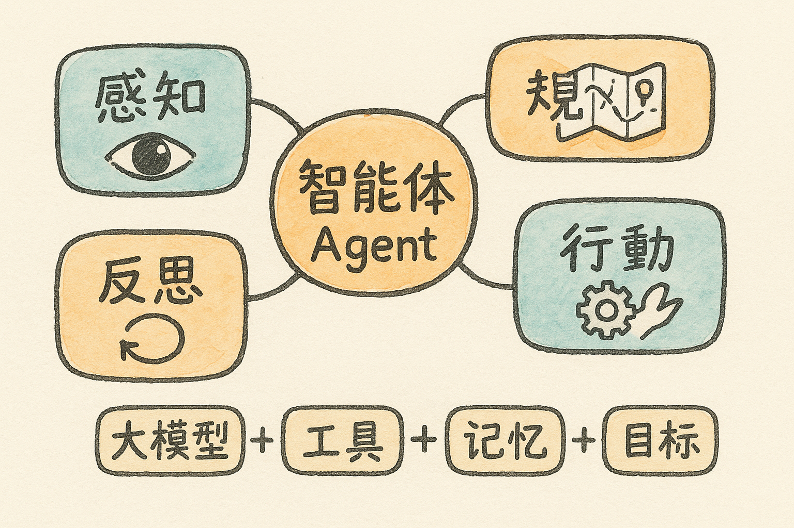

# AI 智能体与大模型的区别 {#sec-agent-vs-llm}

{fig-align="center" width="80%"}

## 一句话区分

- **大模型（LLM）**：你问它答，本质是一个"会聊天的大脑"——给你建议、帮你写文字，但**自己不会动手**。
- **智能体（Agent）**：大脑 + 工具 + 记忆 + 目标。它能**读你的文件、填你的表、操作软件、连续完成多步任务**，是一个"会干活的数字同事"。

> 同样问"帮我做个客流/运量分析"：大模型告诉你"应该怎么做"；智能体直接把六个月度 Excel 合并、算好、画成图、生成报告存到你桌面。

## 现场演示：智能体"会动手"

本章通过几个现场动作，直观感受智能体与大模型的差别：

### 演示 1：自己读微信、发公众号

智能体可以读取微信公众号消息、并完成公众号内容发布等动作——而不仅仅是"教你怎么发"。

### 演示 2：自己填表

把一份通知里的表格交给智能体：

> 根据电脑中我的个人信息，填写这个表
>
> （示例文件：`Desktop\...关于报送《事业单位工作人员奖励审批表》的通知\....docx`）

智能体读取本机已有的个人信息，自动把表格填好。

### 演示 3：自己发问卷并分析

用腾讯问卷做一个现场调查问卷，扫码即可填写，问题示例（贴合班组实际）：

- 你现在用哪些 **AI 大模型**辅助办公？（DeepSeek、豆包、Kimi、ChatGPT、Gemini、Claude）
- 用过哪些**智能体**？（OpenClaw、Workbuddy、Claude Code、Codex）
- 是否用过 IMA 等知识库工具？
- 平时最想让 AI 替你分担哪类工作？（台账/报表汇总、公文与简报、会议纪要、制度/政策解读、安全检查记录整理……）

并把问卷生成二维码存到桌面、加上标题"班组 AI 智能体使用情况现场调查问卷"。

::: {.callout-tip}
## 配套 Skill
`research-report-writing` —— 由调研问卷到分析报告的一条龙。
:::

### 演示 4：批量下载资料

> 把网站 <https://www.zjskw.gov.cn/col/col1229516286/index.html> 中的前三篇文章，转存到共享知识库

智能体自动抓取、下载并归档——这类"重复劳动"正是它的主场。

## 小结 {.unnumbered}

记住这条判断标准：**能不能替你动手、能不能连续完成多步、能不能调用工具与文件**——能，才叫智能体。
