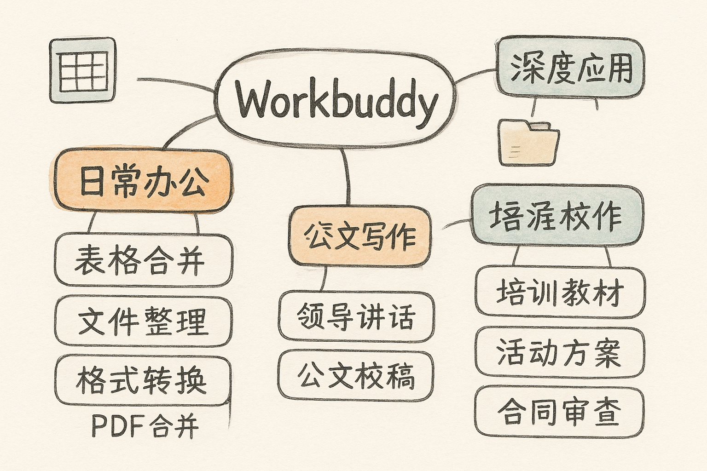

# Workbuddy {#sec-workbuddy}

{fig-align="center" width="80%"}

**Workbuddy** 是一款桌面端办公智能体：你用一句话下指令，它就能操作本机的文件、表格、文档，并调用各类 Skill 完成任务。本章分"日常办公"与"深度应用"两层展开。

## 日常办公 {#sec-wb-daily}

### 案例 1：Excel 数据处理

**提示词：**

```text
把桌面"2026Q1销售数据"里所有 Excel 合并，生成柱状图 + 分析报告
```

**执行效果：** 自动合并多个 Excel 文件，生成可视化图表与分析报告。

配合 `statistical-analysis`（统计数据分析）Skill，可以下更完整的指令：

```text
作为数据分析师，请完成以下任务：
1. 合并桌面文件夹（鹿城集团演示文稿 → excel拼数据分析 子文件夹）中所有销售数据（6 个文件）
2. 计算 Q1 总销售额、各月销售额、各产品销售额、各区域销售占比
3. 生成月度销售柱状图（1月 vs 2月 vs 3月）
4. 生成产品销售 TOP5 柱状图
5. 以 HTML 格式输出 Q1 销售分析报告，包含：执行摘要、数据概览、
   趋势分析、结论建议，以及相关的动态图表
6. 将合并数据和图表保存到桌面文件夹"鹿城集团演示文稿"中
```

::: {.callout-note}
## 可选 Skill
- `statistical-analysis` —— 统计数据分析
- `qianfan-deepresearch` —— 深度研究对话（<https://skillhub.cn/skills/deepresearch-conversation>）

同一套任务，换不同 Skill 执行，可对比效果。
:::

### 案例 2：文件整理归档

```text
整理桌面"文件杂乱"文件夹里的图片，按内容重新命名，并建一个副本
```

**执行效果：** 智能扫描杂乱文件夹，按内容/日期/规则自动分类、重命名、归档。

### 案例 3：文档批量转换

```text
把空间文件夹里"word转pdf基础材料"文件夹中所有 Word 转为 PDF，并按标题重命名
```

**执行效果：** 批量转换文件格式，自动按标题/规则命名。

### 案例 4：PDF 批量合并

```text
把桌面"合同文档"文件夹里所有 PDF 合并成一个文件，按文件名排序
```

**执行效果：** 自动扫描指定文件夹，按文件名排序后合并为单个 PDF，保留原始页码顺序。

### 公文写作

Workbuddy 可与 IMA 知识库结合，完成机关常见文稿：

- **领导讲话**：`lls-leader-speechwriter-expert`（<https://skillhub.cn/skills/lls-leader-speechwriter-expert>），与 IMA 结合
- **公文写作**
- **公文校稿**

## 深度应用 {#sec-wb-advanced}

深度应用的统一范式是：**先 `clawhub install` 安装一个专家 Skill，再用一句话驱动它产出整套成果。**

### 案例 10：培训教材生成

**指令 1 — 安装 Skill：**

```text
clawhub install ida
```

> IDA = Instructional Design Agent（教学设计智能体）

**指令 2 — 使用 Skill 生成：**

```text
请围绕《数字工匠者 AI 办公应用训练营》完成以下任务：
1. 设计一个为期 2 天的培训大纲，覆盖企业文化、规章制度、岗位认知、AI 协作流程
2. 为每个模块生成课程重点、讲义提纲和互动练习
3. 输出 5 道培训测试题，分别为选择题和案例题
最终结果放到空间文件夹中，以"培训教材"命名
```

### 案例 11：活动方案生成

**指令 1 — 安装 Skill：** `clawhub install CopyWriter`

**指令 2 — 使用 Skill 生成：**

```text
请围绕《618 促销活动》完成以下任务：
1. 设计活动目标、活动主题和活动玩法
2. 输出活动预热、爆发、收尾三个阶段的执行安排
3. 生成活动页宣传文案、短信文案和社群通知文案
4. 列出活动所需物料清单和关键时间节点
5. 输出一份活动复盘框架
```

### 案例 12：合同审查辅助

**指令 1 — 安装 Skill：** `clawhub install lawyer`

**指令 2 — 使用 Skill 生成：**

```text
请基于《合同文本》完成以下任务：
1. 提取合同主体、金额、期限、付款、违约责任等核心条款
2. 识别可能存在风险的条款
3. 标记权责不对等、表述不清或内容缺失的内容
4. 生成修改建议
5. 输出一份合同审查意见
```

示例：把 `Desktop\workbuddy专用文件夹\合同文本\乐清市三某局合同.docx` 交给 `lawyer` Skill，即可得到一份结构化的合同审查意见。

::: {.callout-important}
## 务必人工把关
AI 的合同审查、数据分析结果可作为高质量初稿，但**关键决策、法律责任仍在人**，定稿前请核对数据口径与条款原文。
:::
