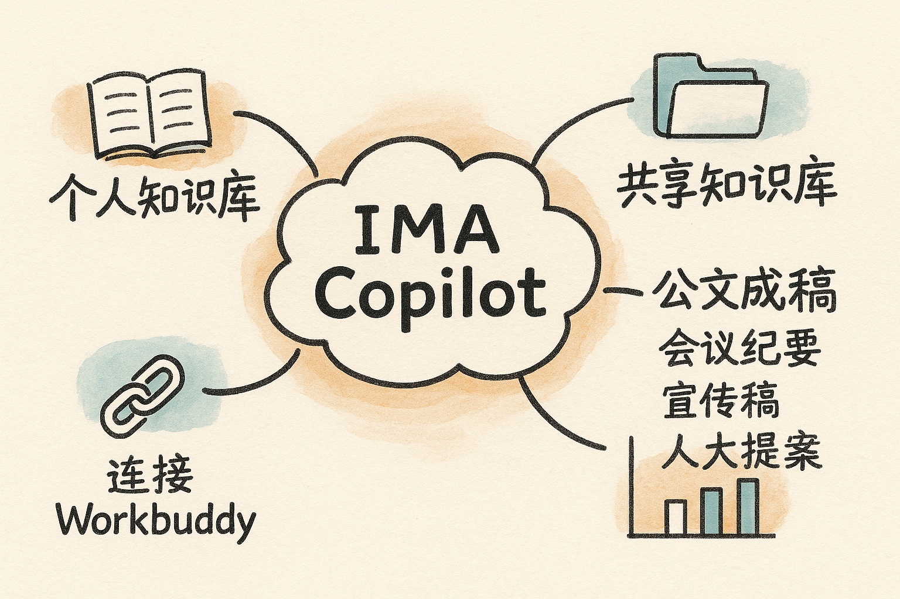

# IMA Copilot（智能体） {#sec-ima}

{fig-align="center" width="80%"}

**IMA** 是一款带"个人知识库 / 共享知识库"的智能体。它擅长把散乱资料结构化、沉淀为可对话的"第二大脑"，并配合各类公文类 Skill 直接产出成稿。

## Workbuddy 连接 IMA {#sec-ima-connect}

Workbuddy 负责"动手抓取与自动化"，IMA 负责"沉淀与调用"，两者打通后形成闭环。

**场景：把持续更新的内容自动存入共享知识库**

- **微信公众号 → 共享库**：监听公众号（如"中国乡村技艺学"）每日更新的文章，自动存入共享知识库"平阳学校"。
  - 参考文章：<https://mp.weixin.qq.com/s/e9kyqmVbWX-bfCzUCd3vfA>
  - 配套：`wechat-watch`
- **本地文件 → 共享库**：

```text
把 Desktop\00_资料清单.md 这个文件添加到共享知识库"平阳学校"
```

- **网站更新 → 共享库**：

```text
把 https://www.zjskw.gov.cn/col/col1229516286/index.html
最近不断更新的文章，转存到共享知识库
```

::: {.callout-note}
## 定时自动化的边界
IMA 智能体可以做"按需转存"，但**定时自动化（如每天定时抓取）需要 Workbuddy** 来承担。
:::

## IMA 实操案例 {#sec-ima-cases}

### 案例 1：个人知识库分类

```text
我的个人知识库里面有哪些文章？进行分类
```

### 案例 2：跨库移动

```text
把个人知识库里某一类文章，移动到共享知识库《政法学苑》
```

### 案例 3：公文撰写（official-document）

```text
对共享知识库《政法学苑》中的文章
"06_深耕综治平台赋能基层善治"，用 Skill: official-document 撰写，
并保存回《政法学苑》，命名为
"06_深耕综治平台赋能基层善治—公文撰稿"
```

> 配套：`official-document`

### 案例 4：会议记录转会议纪要

```text
根据个人知识库中的文章《乡村发展促进共同利益联动机制探讨》，
用 Skill: meeting-minutes-organizer 生成数字会议纪要，
存入共享知识库"温州市人大提案"
```

> 配套：`meeting-minutes-organizer`

### 案例 5：宣传稿生成

```text
请根据以下活动资料，生成 800 字宣传稿。
要求：突出中小学特色、群众获得感、下一步安排，不要空话套话
```

> 配套：`official-doc-writer`

**延伸案例 —— 人大代表提案：**

```text
根据共享知识库"温州市人大提案"，用 Skill: renda-proposal-writer
生成数字人大代表提案
```

> 配套：`renda-proposal-writer`

### 案例 6：自动做政策绘图

用一个"提示词专家"型 Skill，把教育政策文件转化为**政策框架图的绘图提示词**，再交给绘图工具出图。其核心做法是一套**分步交互流程**：

1. **选择图表类型**（政策内容框架图 / 政策落地路径图 / 校办工作推进流程图 / 责任体系图 / 安全管理闭环图 / 鱼骨因果图 / 多方网络图……共十余种）
2. **接收用户文本**（政策文件、上级通知、工作方案、会议纪要等）
3. **深度分析与逐项确认**（图表主题、政策要素、校办工作逻辑、内容丰富度 A/B/C 档、结构图式）
4. **风格偏好询问**（政务黑白/灰度、教育蓝、校园绿、党建红等；纯文字 / 图标点缀 / 汇报展示 / 打印归档等）
5. **生成一份可直接粘贴到绘图工具的中文绘图提示词**

::: {.callout-tip}
## 绘图提示词的硬性要求
专业教育政策框架图、适用中小学校办主任工作场景、白底、严谨、逻辑层次清晰、文字使用中文、**不生成虚假校徽/印章/标识**、避免卡通与过度装饰。
:::

### 案例 6（续）：做 PPT

> 配套：`ppt-afp`（详见《Codex 实操》），即可由要点直接生成演示文稿。

### 案例 7：网站内容转存知识库

```text
把 https://www.zjskw.gov.cn/col/col1229516286/index.html
中的前三篇文章，转存到共享知识库"平阳学校"
```

> 注：定时自动化仍需 Workbuddy。

### 案例（IMA 摘编美文）

```text
整理摘编这篇报告，生成《行业笔记》，
并导入 IMA 共享知识库的"讲座演示"文件夹
```

### 案例 7（会议纪要工具）

`会议纪要自动整理工具` 可把一段**逐字对话**（如关于苗圃、花卉、驿站经营的现场讨论录音转写）自动提炼成结构化纪要：识别发言人、归并核心议题、抽取决议与待办。

### 案例 8：知识库查找

```text
领导突然问 2025 年浙江省政府工作报告的细节，
帮我去 IMA 知识库里搜索并记录
```

## 小结 {.unnumbered}

IMA 的价值在于把"信息散、找不到、整理慢"这一知识工作者的真正瓶颈，变成"**入库即可问、问完即成稿**"。
