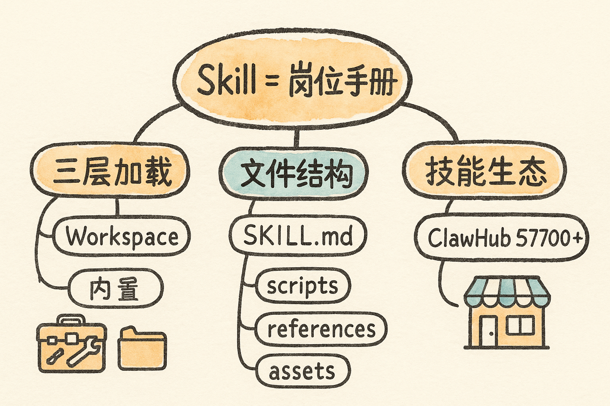

# Skills {#sec-skills}

{fig-align="center" width="80%"}

## Skill 是什么？为什么它是智能体的"灵魂" {#sec-skill-what}

> **Anthropic 官方定义：** Skills 是一套模块化能力，允许开发者通过结构化的文件夹来增强 Claude Code 的能力。每个 Skill 都包含一个核心的 `SKILL.md` 文件以及相关的辅助资源文件。当用户向 Claude Code 提出请求时，它会根据请求内容和 Skill 的描述，**自动判断何时调用相应的 Skill** 来处理这个请求。

一句话理解：如果 OpenClaw 是一个"空白大脑"的员工，那么 **Skill 就是你给他的"岗位培训手册"**。

- ❌ 没装 Skill 的智能体 = 一个刚入职、什么都不会的新人，只能聊天；
- ✅ 装了 Skill 的智能体 = 一个经过岗位培训的熟手，你只要说"帮我做个季报"，它就知道该去哪取数据、用什么格式、发给谁。

::: {.callout-note}
## 生态规模
截至 2026 年 4 月 21 日，OpenClaw 官方技能市场 **ClawHub 已收录 57700+ Skills**，覆盖开发、办公、写作等各类场景。这意味着大部分需求都有现成技能可以**直接安装使用**，你几乎不需要从零开发。
:::

## Skill 的存储位置与加载机制 {#sec-skill-load}

安装前先搞清楚 Skill 装在哪、怎么被加载，能少走很多弯路。**三层加载优先级（从高到低）：**

| 层级 | 路径 | 说明 |
|------|------|------|
| 第一层 · Workspace（最高） | `~/.openclaw/workspace/skills/` | 个人定制技能，优先级最高，可覆盖全局版本 |
| 第二层 · 全局用户级 | `~/.openclaw/skills/` | 通过 `openclaw skills install` 或 `npx skills add` 安装 |
| 第三层 · 内置 Bundled（最低） | OpenClaw 安装自带 | 文件读写、代码执行等基础能力 |

::: {.callout-important}
## 关键点
同名 Skill 可以用 **Workspace 版本覆盖全局版本**——意味着你可以基于官方技能做个性化修改而不影响原版。技能的启用/禁用、注入环境变量、存储 API Key，一般都在 OpenClaw 的 Web 控制台 **Dashboard → Agent → Skills** 页面操作。
:::

## Skill 的结构（渐进式披露） {#sec-skill-structure}

一个 Skill 就是一个文件夹，典型结构如下：

```text
my-custom-skill/
├── SKILL.md      # ★ 核心指令（唯一必需）
├── scripts/      # 可执行代码（Python / Bash 脚本等）
├── references/   # 按需加载的参考文档（技术规范、API 文档、代码片段、设计手册）
└── assets/       # 素材资源（模板、字体、图片、logo、背景素材）
```

- **`SKILL.md`**：核心指令，包含 Skill 名称、触发条件、任务流程、执行手册等；
- **`scripts/`**：存放可被调用执行的脚本；
- **`references/`**：按需加载、主要"给 AI 看"的资料；
- **`assets/`**：模板、字体、图片等素材。

> 除 `SKILL.md` 必需外，其余均为可选，可按自己的 Skill 需要灵活配置。

**一个最小的 `SKILL.md` 模板：**

```markdown
# My Custom Skill

## Description
这是一个自定义技能，用于 [你的需求描述]

## Trigger Keywords
- 关键词1
- 关键词2

## Instructions
1. 当用户提到 [触发条件] 时，执行以下步骤：
2. 第一步：[具体操作]
3. 第二步：[具体操作]
4. 输出格式：[格式要求]

## Dependencies
- 需要的 API Key：[说明]
- 需要的工具：[说明]
```

## 工具列表：到哪里找 Skill {#sec-skill-hubs}

下面是几个面向中国用户、下载体验较好的 AI Skills 社区与仓库：

- **ClawHub（腾讯）**：<https://skillhub.tencent.com/#featured> —— 精选推荐、高速下载
- **yunshu0909/yunshu_skillshub**：含 `github-repo-search` 等技能
  - 安装方式：直接告诉你的智能体——"安装这个 GitHub 仓库的 Skills：`https://github.com/yunshu0909/yunshu_skillshub`"
- **StepClaw 技能广场**：做学计相关技能
- **ClawHub.ai（免科学上网）**：<https://clawhub.ai/skills?sort=downloads> —— 下载后把链接发给智能体即可
- **SkillsMP**：<https://skillsmp.com/>
- **awesome-xiawang-skills**：社区精选合集
- **SkillHub（agent-browser-cli）**：<https://skillhub.cn/skills/agent-browser-cli>

::: {.callout-tip}
## 安装范式
绝大多数技能的安装都极其简单：**把技能的安装命令或仓库链接直接发给你的智能体**，它会自检是否已安装对应仓库、未装则先装仓库再装技能。例如 `clawhub install <skill>`。
:::
