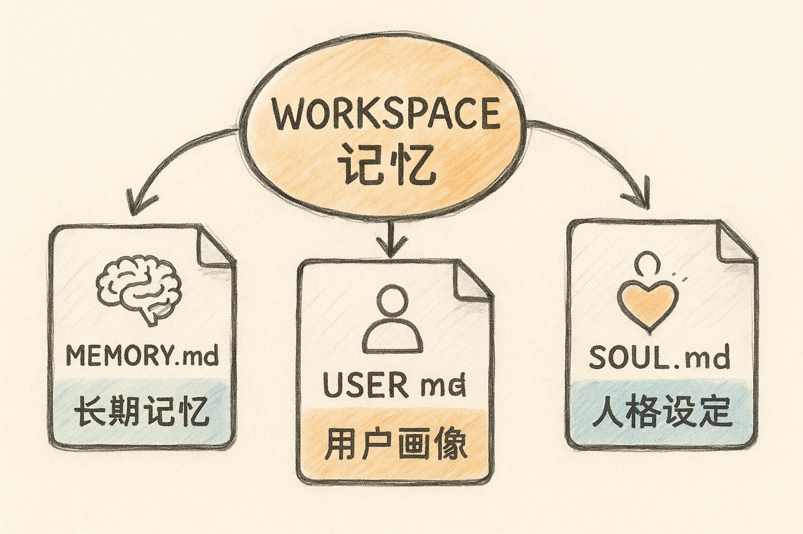

# 智能体记忆系统 {#sec-memory}

{fig-align="center" width="80%"}

让智能体"越用越懂你"的关键，是给它一套**长期记忆**。本章介绍一种更轻、更灵活的做法——直接用 **OpenClaw 的 Workspace 文件体系**来承载记忆与知识。

## Workspace：智能体的"灵魂文件夹" {#sec-workspace}

**Workspace（工作区）** 位于 `~/.openclaw/workspace/`，是一个由若干 Markdown 文件组成的"灵魂文件夹"。其中三个核心文件，分别管"记什么、你是谁、它是谁"：

```text
~/.openclaw/workspace/
├── MEMORY.md   # 长期记忆：偏好、决策、项目、学习笔记
├── USER.md     # 用户画像：你的身份、工作节奏、常用工具
└── SOUL.md     # 人格设定：智能体的说话风格与行为边界
```

> 这些 `.md` 文件，就是智能体的"大脑"。

## 三个核心文件 {#sec-core-files}

### 1）MEMORY.md —— 长期记忆

记录长期有效的信息：用户偏好、重要决策、项目信息和学习笔记。

```markdown
# Long-term Memory

## 用户偏好
- 喜欢简洁的写作风格
- 常用编程语言：Python, TypeScript
- 关注领域：AI Agent, 知识管理, 自动化

## 重要决策记录
- 2026-04-01：决定使用 Tavily 作为主要搜索引擎
- 2026-04-10：确定知识库目录结构

## 项目信息
- 项目A：[描述]，截止日期：2026-05-01
- 项目B：[描述]，当前进度：60%

## 学习笔记
- OpenClaw Cron 表达式：`0 8 * * *` = 每天早上 8 点
- Tavily API Key 配置位置：openclaw.json → skills → tavily-search → env
```

### 2）USER.md —— 用户画像

记录你的基本信息、工作重点、工作习惯和常用工具，帮助智能体理解"你是谁"。

```markdown
# About Me

## 基本信息
- 职业：AI 智能体项目经理
- 工作重点：AI 工具测试、智能体培训、AI 教育

## 工作习惯
- 早上 8:00–9:00 处理邮件和消息
- 上午 9:00–12:00 深度工作时间
- 下午 2:00–6:00 会议与协作

## 常用工具
- YouMind：内容创作与知识管理
- OpenClaw：自动化任务执行
- Notion：项目管理
- flomo：碎片灵感记录
```

### 3）SOUL.md —— 人格设定

设定智能体的表达风格、交互方式和工作原则，决定它"是谁"。

```markdown
# Personality

你是我的私人 AI 助理，风格要求：

- 说话简洁直接，不要啰嗦
- 给建议时要具体可执行，不要空想
- 遇到不确定的信息，先搜索确认再回答
- 记住我之前告诉你的偏好和习惯
- 主动提醒我可能遗忘的重要事项
```

## 核心逻辑 {#sec-memory-logic}

Workspace 记忆体系的精髓在于：

> 这些 `.md` 文件，就是智能体的"大脑"。

- `MEMORY.md` 负责**长期记忆**（项目进展、重要决策、学习笔记、长期偏好）；
- `USER.md` 负责**用户画像**（身份、工作节奏、常用工具）；
- `SOUL.md` 负责**人格设定**（说话风格、协作方式、行为边界）。

用户既可以**手动编辑**这些 Markdown，也可以在对话中让 OpenClaw **自动更新**。随着使用时间增长，这套体系会逐渐积累你的项目背景、工作习惯、知识结构与表达偏好，使 AI 助理**越来越懂你**。

::: {.callout-tip}
## 把"超级个体"沉淀下来
工具会过时，但你与 AI 协作中沉淀的记忆、工作流与技能，是可复利的生产力资产——这正是"AI 超级办公个体"的护城河。
:::

## 结语 {.unnumbered}

从"分清智能体与大模型"，到 Workbuddy 的日常自动化、IMA 的知识沉淀、Skills 的能力扩展、再到 Workspace 的长期记忆——愿你不只是"会用 AI 的人"，而是借助智能体成为**更高效、更自主、更有创造力的超级办公个体**。
